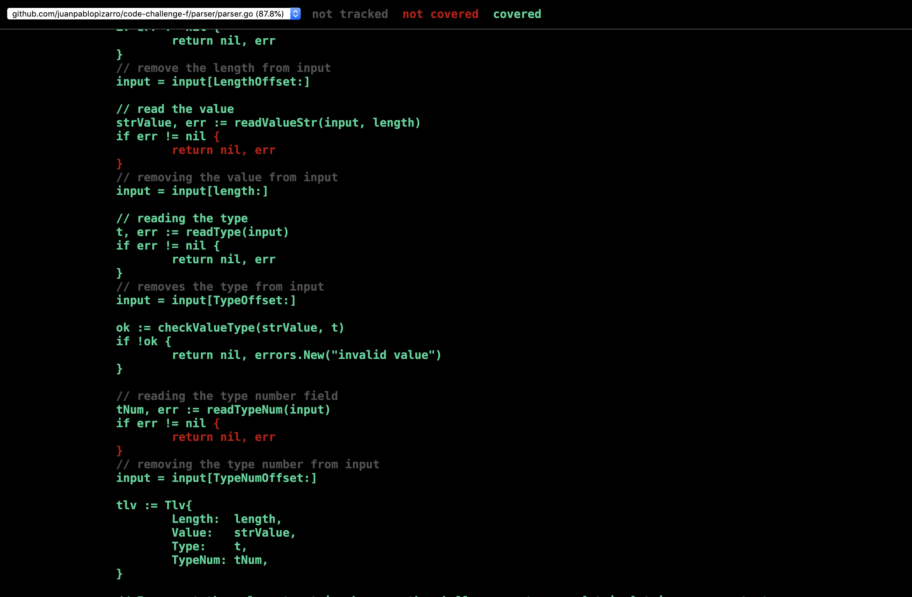

# FIF Code Challenge 2

## Summary
This project solves the code challenge 2. The challenge can be found [here](https://github.com/falabella-fif-inte/test-2).

## The Solution
I focus my solution on KISS principle. Usually I follow one of the [standard project layout](https://github.com/golang-standards/project-layout) but as you can see due the simple of the code challenge I didn't use `/cmd` as well as `/pkg` or `deploy`. 

Back to the solution, I crated a file `parser/parser.go` that contains a `Unmarshal` function that receives a `[]byte` and returns `map[string]string, error` as the challenge require. My approach is based on the slice descriptors ([reading](https://blog.golang.org/go-slices-usage-and-internals)) so the original input is always the same but the descriptors changes.

The project structure is something like:


No rocket science here. As I mentioned before, I didn't follow the standard 100%.

Into the `Unmarshal` function I iterate the byte slice reading the fields one by one using different functions to be clear and because flexibility. Some modifications could be explored like use design patterns like visitor or iterator, etc but is not needed at all.

The file `parser_test.go`, as its name says holds some tests that you can run with:

```
go test test/parser_test.go -count=1 -cover -coverpkg ./...
```

`-count=1` prevents the cache
`coverpkg ./...` is to tell the test that can use another files in the directory tree.
`-cover` yup, is to tell the `go test` command that we want to know the coverage.

The output is:


## Next steps
Due the hurry, I miss the 100% of coverage.. actually 87.8% is good for any project. I miss some extras like show the coverage using `go tool cover -html=test.out` having saved the test coverage analysis before using something like `go test test/parser_test.go -coverprofile=test.output -v -coverpkg=./...`. In this way we can see which code is covered and which not. Like this:



I added some trivial travis integration but I could add some deploy, more artifacts like jobs or before_script, after_script, etc, etc. One think I would do is to add the test output files into a repo, s3 or other. My travis file has just:

```
language: go

go:
    - 1.x

script:
    - go test test/parser_test.go -coverprofile=test.output -v -coverpkg=./...
```
And the output is like:


Another thing I didn't do is to create a develop branch, pull requests and all the things that are too complex for a single function.
